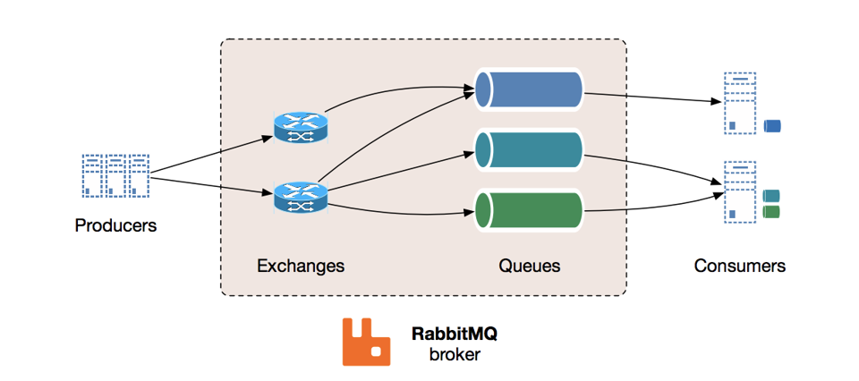
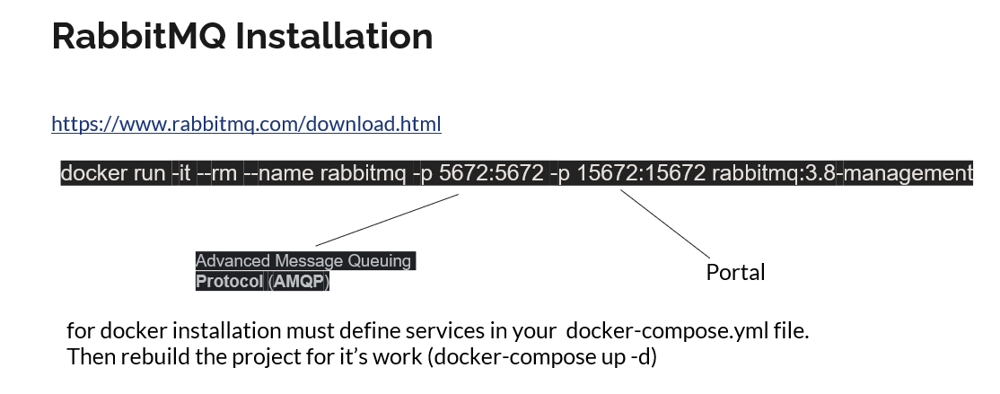

# What is Message Queue

Message queues allow different parts of a system to communicate and process operations asynchronously. A message queue provides a lightweight buffer which temporarily stores messages, and endpoints that allow software components to connect to the queue in order to send and receive messages. The messages are usually small, and can be things like requests, replies, error messages, or just plain information. To send a message, a component called a producer adds a message to the queue. The message is stored on the queue until another component called a consumer retrieves the message and does something with it.

## 

given code has been taken from https://github.com/salihcantekin/RabbitMQ.Project_Desktop.

  